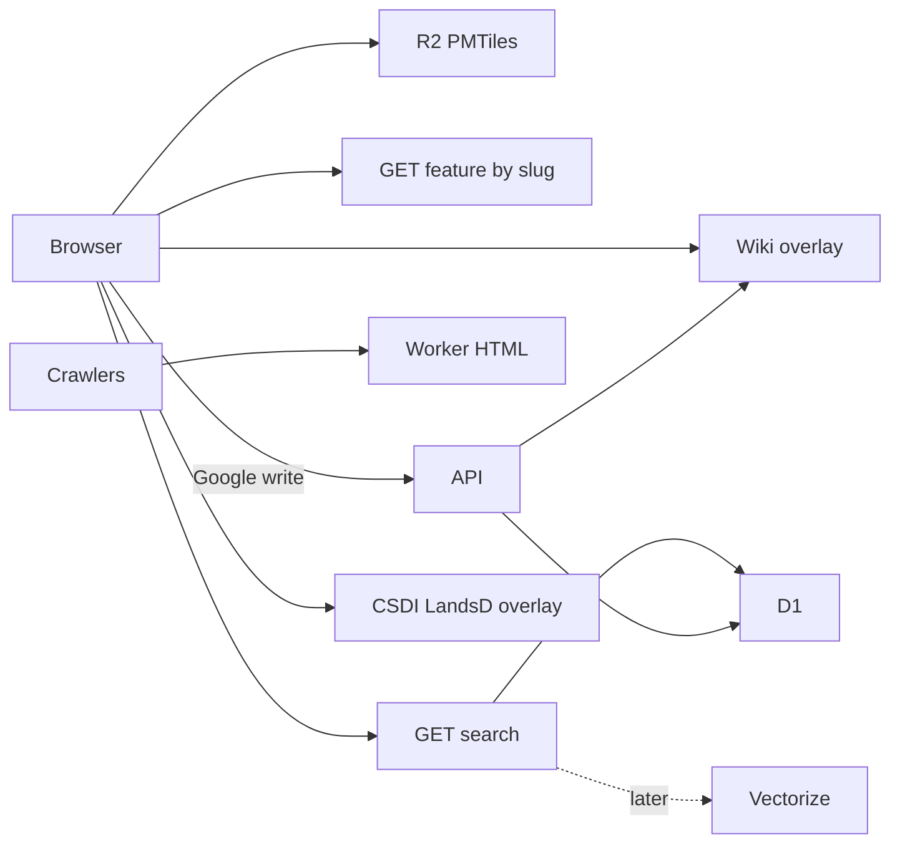

# HK Place Atlas v1

Bilingual public map of Hong Kong (design for **100k–300k** pins). Cloudflare Worker + D1 + R2. Users add **kinds** of items (establishment, shop, event, …) as points with a time range; links go through `edges`.

Living spec for implementation. Phase 0 is local `wrangler` + Vite. Phase 1 serves the same SPA and API from one Worker (`assets` + D1).



## Spec

**Public:** map, year slider, site panel, search, kind-specific pages. No login to view.

**Wiki:** Google sign-in to add/edit/delete. Pick **kind** on create. Immediate publish. Rate limit (~30 writes/hour). `If-Match` on `updated_at`.

**Catalog:** one `features` table, points only (`lng`, `lat`). `kind` discriminates occupancy vs occurrence. No draw tool. CSDI/LandsD are live overlays, never stored.

**Kinds (extensible):**

| kind | What it is | Time range means | Year slider | Public URL | JSON-LD |
|---|---|---|---|---|---|
| `establishment` | building / generation (BDBIAR seed) | built → demolished | standing that year | `/en/place/{slug}` | `LandmarksOrHistoricalBuildings` |
| `shop` | business at a point (may `located_in` a building) | opened → closed | trading that year | `/en/place/{slug}` | `LocalBusiness` |
| `event` | something that happened | started → ended | overlaps that year | `/en/event/{slug}` | `Event` + `location` |
| later `agent` | person/firm | usually no pin | not on map | `/en/agent/{slug}` | `Person` / `Organization` |

Do not store an event as a fake establishment. New kinds = new `kind` value + URL prefix + JSON-LD type; **same table, same tiles, same APIs**.

**Lineage / graph:** `edges` (`from_type`/`to_type` = kind or `csdi_building`). v1 seed has no edges. Wiki: `site_successor`, `institution_successor`, `located_in`, `occurred_at`. Viewport `querySite` uses proximity + occupancy kinds.

**Dates:** one interval `start_*` / `end_*` (`FuzzyDate`). Occupancy kinds: start=built/opened, end=demolished/closed. Events: start/end of the happening. `status` for occupancy: standing | demolished | unknown.

**URLs:** `/en`, `/zh-hk` map. Occupancy → `/en/place/{slug}`; events → `/en/event/{slug}` (and zh-hk). `hreflang` `en` + `zh-Hant` + `x-default` → `/en/…`. Language switcher.

**Indexable pages:** curated or wiki-enriched only. Stubs: `noindex`. schema.org via `schema-dts`. `sameAs`, successor / `located_in` / `occurred_at` from edges.

**Photos (later):** R2 upload; URL in `body.images`.

## Data

**Seed file (only):** [BDBIAR_BDBIAR_converted.csv](../../../BDBIAR_BDBIAR_converted.csv) (~51k building rows, all HK). Do not use `BDBIAR_Central_and_Western.csv` or `src/storage/seed.ts`. Import once via `npm run seed`. Group rows as in `scripts/bdbiar.ts` (same OP + English address → one feature). `id` = `bdbiar-{buildingId}` (first member). **`kind=establishment`.** `touched=0` → catalog GeoJSON/PMTiles. Wiki `touched=1` → overlay. Rebuild tiles on re-import only. Local `--sample` is optional; production seed is the full CSV.

CSV → feature: NSEARCH1_E → id suffix / bdbiarId; ADDRESS_E/C → names; NSEARCH3_E → `start_*`; LONGITUDE/LATITUDE → lng/lat; NSEARCH5 → tags/useZh; NSEARCH2_E → opNumber; SEARCH1_E/SEARCH2_E → district/region in `body`. Status `standing`; notes empty. **No seed edges.**

### Schema (D1)

```sql
CREATE TABLE features (
  id            TEXT PRIMARY KEY,
  kind          TEXT NOT NULL,
  slug          TEXT NOT NULL UNIQUE,
  name_en       TEXT NOT NULL,
  name_zh       TEXT NOT NULL DEFAULT '',
  status        TEXT NOT NULL,
  start_year    INTEGER,
  start_month   INTEGER,
  start_day     INTEGER,
  start_circa   INTEGER NOT NULL DEFAULT 0,
  end_year      INTEGER,
  end_month     INTEGER,
  end_day       INTEGER,
  end_circa     INTEGER NOT NULL DEFAULT 0,
  lng           REAL,
  lat           REAL,
  body          TEXT NOT NULL,
  touched       INTEGER NOT NULL DEFAULT 0,
  created_at    TEXT NOT NULL,
  updated_at    TEXT NOT NULL,
  created_by    TEXT,
  updated_by    TEXT
);

CREATE TABLE edges (
  id          TEXT PRIMARY KEY,
  from_type   TEXT NOT NULL,
  from_id     TEXT NOT NULL,
  to_type     TEXT NOT NULL,
  to_id       TEXT NOT NULL,
  rel_type    TEXT NOT NULL,
  note        TEXT,
  valid_from  TEXT,
  valid_to    TEXT,
  UNIQUE (from_type, from_id, to_type, to_id, rel_type)
);

CREATE TABLE slug_history (
  old_slug    TEXT PRIMARY KEY,
  feature_id  TEXT NOT NULL REFERENCES features(id)
);

CREATE TABLE users (
  sub         TEXT PRIMARY KEY,
  email       TEXT NOT NULL,
  created_at  TEXT NOT NULL
);

CREATE TABLE audit_log (
  id          TEXT PRIMARY KEY,
  at          TEXT NOT NULL,
  actor_sub   TEXT,
  actor_email TEXT,
  action      TEXT NOT NULL,
  entity_type TEXT NOT NULL,
  entity_id   TEXT NOT NULL,
  before_json TEXT,
  after_json  TEXT
);
```

`body` JSON: `{ notes, sources[{label,url}], images[{label,url}], tags[], customFields[{key,value}], district?, region? }`.

APIs: `GET /api/features/{slug}`, `GET /api/features?bbox=&year=&kind=`, `GET /api/search?q=`, `GET /api/edges?featureId=`, `GET /api/me`, authenticated `PUT/DELETE`.

Year filter: occupancy kinds if start≤year and (end is null or year < end); events if the interval overlaps year.

## Search

**v1:** D1 FTS5 (`unicode61`) on English names/slugs with prefix match. Chinese uses substring match on `name_zh` / `name_en` (so 2-character names like 高街 hit). Cap 20. Optional `year` / `kind`. No login. **Later:** Vectorize.

## Map

MapLibre GL + OpenFreeMap. Tiles/catalog GeoJSON carry `kind`. Click → bbox + `querySite` on occupancy kinds.

## User journeys

### Phase 0 / 1 (anonymous, read-only)

1. Open `/en` or `/zh-hk` — clustered pins, no login.
2. Pan and zoom — pins split; occupancy kinds standing in the year.
3. Scrub the year.
4. Click a pin — site panel (names, dates, notes, sources, edges).
5. Click the map — nearby features in the viewport.
6. Switch language `/en` ↔ `/zh-hk`.
7. Read-only — no Add/Edit/Sign in/search.

Wiki, search, SEO HTML, audit, GIS proxy, photos, Vectorize: later phases. GIS is Phase 6.

### Phase 2 (wiki)

8. Sign in with Google (any Google account).
9. Click the map, **Add**, pick a kind (establishment / shop / event), save — publishes immediately.
10. **Edit** any feature. **Delete** wiki-created rows only (seed catalog pins stay until tiles rebuild).
11. Writes are rate-limited (~30/hour) and updates require `If-Match` on `updated_at`.

### Phase 3 (search)

12. Type in the search box — bilingual matches (English prefix, Chinese substring), standing in the current year.
13. Pick a hit — opens that place/event. No login required.

### Phase 4 (SEO HTML)

14. Crawlers requesting `/en`, `/zh-hk`, `/en/place/{slug}`, `/en/event/{slug}` (and zh-hk) get HTML with title, description, `hreflang`, and JSON-LD. The SPA still boots for browsers.
15. Seed stubs (`touched=0`) send `noindex`. Wiki-enriched rows (`touched=1`) are indexable. Unknown slugs are 404 + `noindex`.

### Phase 5 (audit / revert)

16. Open a place — **History** lists wiki writes (who, when, put/delete/revert).
17. Signed-in users **Revert** an entry: restore the previous snapshot, or delete a wiki-created row if reverting its create. Seed catalog rows still cannot be deleted. Revert is rate-limited and audited.

### Phase 6 (GIS overlay proxy)

18. Click the map (or open a pin) — CSDI building footprints and LandsD lots at that point draw live and feed the site panel. Nothing from CSDI/LandsD is stored.
19. City-scale views do not fetch GIS. Browser calls `/api/gis/*`; the Worker allowlists CSDI WFS and LandsD geodata only (CORS, cache, no open proxy).

Photos, Vectorize, custom domain: later phases.

## Cost (USD)

Phase 0 is $0 (local). Phase 1–5 typically $0 on Cloudflare free; budget **~$5/mo** Workers Paid if API/GIS proxy is busy. R2 egress $0. Domain ~$10–15/year.

## Phases

0. Local wrangler + Vite, D1, seed, catalog, MapLibre, journeys 1–7 on localhost.
1. Deploy the same stack to Cloudflare (`hk-atlas` Worker, D1, SPA assets including catalog GeoJSON). No custom domain in this phase.
2. Google wiki + kind picker.
3. Fuzzy search.
4. `/en` `/zh-hk` HTML + JSON-LD.
5. Audit / revert.
6. GIS overlay proxy if CORS requires it.
7. Later: Vectorize, photos, more kinds.
8. **Last:** attach the custom domain to `hk-atlas` (workers.dev stays as the origin until then).

## Out of scope

Stored polygons, Neo4j/AGE, discussions, moderation queue. Do not invent a new table per kind.
