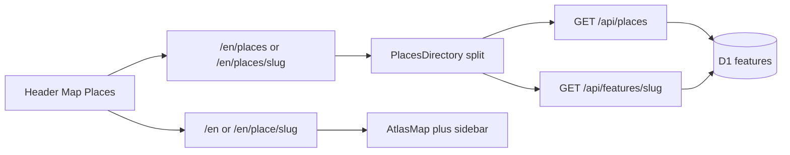

# Places directory

A second public view besides the map: a paginated directory of every occupancy place (~38k now, designed toward 100k+).

## Goal

People can browse and open places without the map. Map stays `/en` and `/zh-hk`. Places is a peer view in the header.

## URLs

| Path | View |
|------|------|
| `/en`, `/zh-hk` | Map (unchanged) |
| `/en/places`, `/zh-hk/places` | Directory, no row selected |
| `/en/places/{slug}`, `/zh-hk/places/{slug}` | Directory with that row selected |
| `/en/place/{slug}`, `/zh-hk/place/{slug}` | Existing map + sidebar (unchanged) |

`/places` (plural) must not be parsed as `/place/{slug}`. Lang switch keeps the rest of the path and the query string.

Browse state lives in the query string: `page`, `letter`, `q`. Example: `/en/places/jardine-house-1973?letter=J&page=2`.

Header search from Places navigates to `/en/places/{slug}` (stay on the directory) and does not apply a year filter. Header search from Map still goes to `/en/place/{slug}` and still follows the year slider.

The Map tab always goes to `/{locale}`. The Places tab always goes to `/{locale}/places`. Neither tab keeps a selected slug; **View on map** is the way to open the same place on the map.

Closing the detail pane (desktop) or Back (mobile) goes to `/{locale}/places` and keeps `page` / `letter` / `q`.

## Chrome

Header: title, **Map | Places** tabs, existing `SearchBox`, language switch, auth if enabled.

Places view hides the map, year slider, and map sidebar. Search exists twice: header `SearchBox` (jump to a hit, all years) and a list filter in the left pane (narrows the directory).

No year slider on Places. The directory lists every occupancy place, all years.

## Layout

**Desktop.** Split: list left, detail right. Both visible.

**Mobile (max-width 800px, same breakpoint as today).** List or full-width detail with a back control. Split does not fit.

Left pane:

- Filter input (`q`)
- A–Z letter index plus `#` (non A–Z English initials). While `q` is set, letter is ignored and the index is inactive.
- ~50 rows per page
- Each row: locale display name (`displayNames`) and standing years (`start–end`, or `start–` if still standing)
- Selected row highlighted
- Pager: previous / next and page numbers

Right pane:

- Empty: prompt to pick a place
- Selected: existing place detail (notes, sources, tags, audit if signed in) plus **View on map** → `/en/place/{slug}` (or zh-hk)
- Unknown slug: list still loads; detail shows not found

Events are not in this directory (`kind` is `establishment` or `shop` only).

## Data

New public API: `GET /api/places`.

Query params:

- `page` — 1-based, default 1
- `pageSize` — default 50, max 100
- `letter` — `A`–`Z` or `#`; ignored when `q` is set
- `q` — optional filter
- `locale` — `en` or `zh-hk` (sort and display order)

Response:

```json
{
  "page": 1,
  "pageSize": 50,
  "total": 38492,
  "features": [
    {
      "slug": "jardine-house-1973",
      "kind": "establishment",
      "nameEn": "Jardine House",
      "nameZh": "怡和大廈",
      "status": "standing",
      "startYear": 1973,
      "endYear": null
    }
  ]
}
```

Rules:

- Occupancy kinds only
- Sort by locale name: `name_en` on `/en`, `name_zh` then `name_en` on `/zh-hk`
- Letter filter is always the first A–Z of `name_en` (uppercase). `#` is everything else (digits, punctuation, empty, CJK-only English name)
- `q` reuses the existing FTS5 + Han matching in [`src/domain/search.ts`](../../../src/domain/search.ts), but paginated to `pageSize` with a `total` count — not the map search cap of 20
- Detail remains `GET /api/features/:slug`

Do not load `/catalog.geojson` on the Places view. That file is for the map.

## App shape

[`src/AtlasApp.tsx`](../../../src/AtlasApp.tsx) already owns History API routing. Extend it:

1. Parse `/places` and `/places/{slug}` next to `parseFeaturePath` in [`src/domain/locale.ts`](../../../src/domain/locale.ts).
2. If the rest path is the directory, render a `PlacesDirectory` instead of the map workspace.
3. Keep header chrome; swap the Map/Places active tab from the path.

New UI: [`src/ui/PlacesDirectory.tsx`](../../../src/ui/PlacesDirectory.tsx) (list + pager + letter index + filter + detail slot). Reuse [`src/ui/EstablishmentDetail.tsx`](../../../src/ui/EstablishmentDetail.tsx) / feature-as-establishment for the right pane rather than a second detail component.

List query builder lives in domain (pure functions + tests), Worker executes SQL. Wire `GET /api/places` through [`src/api/router.ts`](../../../src/api/router.ts) and [`worker/index.ts`](../../../worker/index.ts). Browser client next to [`src/api/features.ts`](../../../src/api/features.ts).



## SEO

- `/en/places` and `/zh-hk/places` are indexable directory pages (title/description like the home page, about browsing all places).
- `/en/places/{slug}` is shareable UI state. Canonical URL is the existing map page `/en/place/{slug}`. Do not add `/places/{slug}` rows to the sitemap.
- Add `/en/places` and `/zh-hk/places` to the sitemap homes (alongside `/en` and `/zh-hk`).
- Worker SEO injection (`parseSeoPath`) must recognize the directory so crawlers get a real title, not an empty SPA shell.

## Errors

- List fetch fails: error in the list pane, retry.
- `q` matches nothing: “No places” / existing `noResults` copy.
- `page` past the end: clamp to the last page.
- Unknown slug: list OK, detail not found.
- Invalid `letter`: treat as no letter filter.

## Tests

- `parsePlacesPath` / `placesPublicPath`: `/places` vs `/place/{slug}`, locale switch, query string kept.
- `/api/places`: occupancy-only, page size, letter `#`, `q` pagination vs map search’s 20 cap, locale sort.
- SEO: directory path is a home-like page; `/places/{slug}` canonical points at `/place/{slug}`; sitemap includes `/places` and does not include `/places/{slug}`.
- Router: `GET /api/places` is a new route, distinct from bbox `GET /api/features`.

## Out of scope

- Events directory
- Year filter on the list
- Changing map cluster/idle behavior
- Static HTML dump of all places
- Loading the GeoJSON catalog for this view
